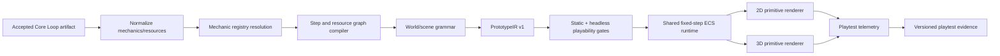

# Gidede — алгоритм генерации играбельных 2D/3D прототипов из Core Loop

**Статус:** design specification 1.0  
**Дата:** 2026-08-02  
**Цель:** заменить набор жанровых мини-игр компилятором, который строит проверяемый playable prototype из выбранных механик, шагов и resource flow Core Loop Designer.

## 1. Решение в одном абзаце

Gidede должна компилировать принятый и актуальный `CoreLoopArtifact` не сразу в JavaScript, а в versioned declarative `PrototypeIR`. Каждый canonical mechanic ID разрешается через реестр безопасных mechanic adapters. Адаптеры добавляют в IR input actions, entities/components, rules, resource transitions, objectives и telemetry. Затем deterministic scene grammar размещает только примитивы, общий fixed-step runtime исполняет правила, а 2D и 3D renderers визуализируют одну и ту же симуляцию. До выдачи HTML IR проходит coverage, reachability и headless playability gates. Нераспознанная обязательная механика блокирует сборку или требует явного пользовательского mapping; она никогда не заменяется молча generic-кликером.

## 2. Почему текущий генератор недостаточен

Текущая реализация уже создаёт запускаемый HTML, но проверяет главным образом выбранный template, а не спроектированный Core Loop:

- `buildPrototypeConfig()` читает `structuralType` и до пяти строк steps;
- `mechanics`, `resources_consumed`, `resources_produced`, feedback и resource graph в конфигурацию не попадают;
- 2D и 3D содержат отдельные hardcoded реализации шести мини-игр;
- steps показываются пользователю текстом, но не определяют rules;
- `hybrid`, поддерживаемый Core Loop Designer, отсутствует в valid prototype types и превращается в `engine`;
- node compiler имеет только generic event/entity/data nodes и не умеет выразить canonical mechanics и resource transitions Core Loop;
- два независимых code emitters создают риск, что 2D и 3D варианты проверяют разные правила.

Следовательно, существующий прототип доказывает только то, что шаблон запускается. Он не доказывает, что выбранные дизайнером механики образуют играбельный цикл.

## 3. Границы задачи

### Должно быть

- браузерная 2D или 3D мини-игра из геометрических примитивов;
- 30–90 секунд до проверяемого исхода или завершения нескольких core-loop итераций;
- игровая логика трассируется до конкретных Core Loop steps/mechanics/resources;
- одинаковые rules, seed, objectives и telemetry в 2D и 3D;
- детерминированная сборка без обязательного LLM;
- безопасный declarative runtime без исполнения model-generated JavaScript;
- честный отчёт о mechanic coverage, assumptions и unsupported mappings.

### Не должно быть

- попытки автоматически создать production-quality игру;
- генерации арта, уровней и нарратива вместо проверки механики;
- подмены неизвестной механики ближайшим шаблоном без evidence и подтверждения;
- объявления fun доказанным по статическому анализу или bot simulation;
- отдельных несвязанных правил для 2D и 3D.

## 4. Архитектура



Ключевой выбор: `PrototypeIR` является единственным источником gameplay semantics. Renderer отвечает только за камеру, ввод и отображение компонентов.

## 5. Входной контракт

Компилятор принимает snapshot принятого Core Loop:

```ts
interface PrototypeCompileInput {
  projectId: string;
  coreLoopArtifactRef: string;
  conceptArtifactRef: string;
  genre: string;
  structuralType: string;
  structuralSubtype?: string;
  steps: Array<{
    id: string;
    action: string;
    mechanicIds: string[];
    resourcesConsumed: string[];
    resourcesProduced: string[];
    feedbackType: "positive" | "negative" | "neutral";
    durationEstimateSec: number;
  }>;
  resourceGraph: {
    edges: Array<{ fromStepId: string; toStepId: string; resourceIds: string[] }>;
  };
  funHypothesis: {
    hypothesisId: string;
    statement: string;
    protocol: unknown;
  };
  buildOptions: {
    dimensions: Array<"2d" | "3d">;
    targetSessionSec: number;
    difficulty: "easy" | "baseline" | "hard";
    seed?: string;
    mappingOverrides?: Record<string, string>;
  };
}
```

Предусловия:

1. Core Loop имеет `accepted` и `fresh` status.
2. Resource graph замкнут по правилам Core Loop validation.
3. Каждый step имеет стабильный ID, а mechanics используют canonical namespace.
4. `targetSessionSec` ограничен, например, диапазоном 20–120 секунд.
5. Input и artifact lineage проходят versioned Zod schema.

Canonical mechanic IDs — обязательная зависимость. Поэтому реализация compiler registry должна опираться на `R4-07`, а до неё допустим только versioned alias resolver с явным evidence.

## 6. PrototypeIR

```ts
interface PrototypeIR {
  schemaVersion: "1.0.0";
  runtimeVersion: string;
  seed: string;
  source: {
    projectId: string;
    artifactVersions: Record<string, string>;
    hypothesisId: string;
  };
  session: {
    targetDurationSec: number;
    fixedStepHz: 60;
    success: PredicateSpec;
    failure: PredicateSpec[];
    loopTarget: number;
  };
  mechanicBindings: MechanicBinding[];
  resources: ResourceSpec[];
  stepMachine: StepStateSpec[];
  scene: SceneSpec;
  entities: EntitySpec[];
  systems: SystemSpec[];
  rules: RuleSpec[];
  objectives: ObjectiveSpec[];
  controls: ControlBindingSpec[];
  telemetry: TelemetrySpec;
  assumptions: string[];
}
```

IR содержит только данные из закрытой taxonomy. В нём нет произвольных JS expressions, HTML, event handler strings или импортов.

## 7. Реестр mechanic adapters

Механика компилируется не по её отображаемому имени, а по canonical ID:

```ts
interface MechanicAdapter {
  adapterId: string;
  version: string;
  mechanicIds: string[];
  capabilities: string[];
  compatibleTopologies: SceneTopology[];
  requiredContext: Array<"player" | "target" | "resource" | "timer" | "base">;
  compile(context: MechanicCompileContext): MechanicFragment;
  validate(fragment: MechanicFragment): Diagnostic[];
  botPolicy?: BotPolicySpec;
}
```

`MechanicFragment` может добавлять только разрешённые:

- components: transform, collider, health, inventory, resource wallet, cooldown, team;
- systems: movement, targeting, collision, collect, combat, spawn, convert, place, timing, puzzle-state;
- rules: typed event → predicates → effects;
- controls: move, aim, primary action, secondary action, interact, place/rotate;
- telemetry events и measurable completion predicates.

### Начальный набор adapters

| Capability | Примеры механик | Primitive behaviour |
|---|---|---|
| locomotion | move, dodge, jump | перемещение actor/capsule, препятствия |
| collect | pickup, gather, loot | collectible → wallet/inventory |
| target/combat | aim, shoot, melee | target, projectile/hitbox, health |
| avoid/survive | stealth, evade, hazard | threat perception, damage/detection |
| interact/deliver | activate, carry, deposit | interaction zone и transfer |
| convert/craft | craft, trade, combine | recipe и resource conversion |
| build/place | build, tower placement | preview, cost, placed entity |
| defend | protect base, wave defense | base health, spawner, attackers |
| upgrade | improve, level | spend resource → parameter modifier |
| transform | rotate, push, redirect | primitive transform и connectivity |
| puzzle | match, connect, route | grid/graph state и validity predicate |
| timing | rhythm, timed input | beat window, streak, miss penalty |

Для social, dialogue, negotiation и иных механик, которые нельзя честно свести к primitive interaction, MVP возвращает `needs_mapping`. Симуляция NPC не должна выдаваться за проверку social mechanic.

## 8. Алгоритм компиляции

### Шаг 1. Normalize

- проверить версии и freshness;
- привести mechanic/resource IDs к canonical namespace;
- дать каждому step/entity/rule стабильный deterministic ID;
- удалить только exact duplicates;
- зафиксировать seed как hash входного snapshot и compiler version.

### Шаг 2. Resolve mechanics

Для каждого mechanic ID:

1. найти exact adapter;
2. применить только versioned alias, если он существует;
3. учесть пользовательский mapping override;
4. иначе сформировать blocking diagnostic `unsupported_mechanic`.

Результат сохраняется как evidence:

```ts
interface MechanicBinding {
  sourceMechanicId: string;
  adapterId: string | null;
  adapterVersion: string | null;
  resolution: "exact" | "alias" | "user_override" | "unsupported";
  representedByRuleIds: string[];
  assumptions: string[];
}
```

### Шаг 3. Compile step/resource state machine

Каждый Core Loop step становится состоянием с:

- activation predicate из `resourcesConsumed`;
- допустимыми player actions из mechanic adapters;
- completion predicate;
- effects, создающими `resourcesProduced`;
- transition в следующий достижимый step;
- telemetry `step_enter`, `action_attempt`, `step_complete`.

Последний step обязан вернуть ресурс/состояние, активирующее первый step, либо завершить одну итерацию и выполнить explicit reset rule. Текст `action` используется как UI label, но не как источник executable semantics.

### Шаг 4. Select scene topology

Scene grammar выбирает topology по сумме affinity всех механик, а structural type используется только как дополнительный prior:

```text
topologyScore = mechanicAffinity + interactionAffinity + structuralPrior - conflicts
```

Поддерживаемые topology MVP:

- `arena` — movement/combat/avoid;
- `lanes` — defense/waves/racing;
- `rooms` — exploration/delivery/stealth;
- `grid` — placement/puzzle/route;
- `node_field` — collect/convert/economy;

Tie разрешается стабильным порядком. Выбранный topology и все scores попадают в compile evidence.

### Шаг 5. Synthesize primitive world

World grammar создаёт минимальное число сущностей, достаточное для выполнения правил:

- player spawn и безопасная стартовая зона;
- targets/resources, необходимые adapters;
- obstacles, boundaries и interaction zones;
- sinks/faucets из resource graph;
- success/failure entities;
- deterministic spawn schedule.

Primitive mapping:

| Semantic role | 2D | 3D |
|---|---|---|
| actor | circle/capsule sprite | capsule/cylinder |
| obstacle | rectangle/polygon | box |
| collectible | circle/diamond | sphere/octahedron |
| projectile | small circle | small sphere |
| interaction zone | outlined circle/rect | transparent cylinder/box |
| base/goal | rectangle | box/cylinder |
| route/link | line | tube/line |

Цвет кодирует роль, а не жанр: player, threat, resource, goal и hazard имеют стабильные контрастные palettes.

### Шаг 6. Derive controls

Controls объединяются из adapter requirements:

- locomotion → WASD/arrows + touch stick;
- aim/target → pointer/right stick;
- primary mechanic → mouse/Space/touch action;
- interact → E/touch context button;
- place/rotate → Q/R или context controls.

Conflict resolver не может назначить две обязательные механики на один input без context predicate или явного chord. Неразрешимый конфликт блокирует build.

### Шаг 7. Calibrate time and quantities

Core Loop durations масштабируются в короткую сессию с сохранением относительных весов:

```text
stepBudget[i] = clamp(minStep, maxStep,
                      targetSession * duration[i] / sum(duration))
```

Количество целей, скорость, spawn interval и resource costs выводятся из step budget и adapter defaults. После headless simulation параметры можно менять только в разрешённых bounds. Каждая коррекция сохраняется как calibration evidence.

### Шаг 8. Validate

Build получает `playable: true` только после всех hard gates:

1. обязательные mechanics имеют bindings;
2. каждый Core Loop step представлен хотя бы одним rule/objective;
3. каждый consumed resource имеет достижимый source;
4. success и минимум один failure/timeout path определены;
5. controls покрывают все player actions;
6. graph не имеет unreachable mandatory state;
7. same IR проходит 2D и 3D renderer capability checks;
8. deterministic policy bot способен завершить loop;
9. idle policy не выигрывает автоматически;
10. runtime не создаёт NaN, unbounded entity growth или event storm.

Bot simulation подтверждает техническую достижимость, а не fun.

### Шаг 9. Emit builds

Компиляция создаёт IR один раз, затем выдаёт два build descriptors:

```ts
interface PrototypeBuildResult {
  status: "playable" | "needs_mapping" | "invalid";
  ir: PrototypeIR;
  builds: {
    "2d"?: { html: string; rendererVersion: string };
    "3d"?: { html: string; rendererVersion: string };
  };
  coverage: PrototypeCoverageReport;
  validation: PrototypeValidationReport;
  artifact: PrototypeArtifactV2;
}
```

Переключение 2D/3D в UI не должно заново выбирать mechanics или rules.

## 9. Общий runtime

Runtime использует fixed timestep и собственную минимальную ECS/Rule VM:

- simulation clock 60 Hz;
- seeded PRNG;
- deterministic entity IDs и spawn order;
- ограниченные entity/rule/event budgets;
- простые circle/AABB/capsule collisions;
- renderer-independent transforms и physics;
- pause/restart/timeout;
- postMessage только по versioned event schema.

Build дополнительно получает закрытый CSP, использует только локально поставляемые renderer assets и запускается в sandboxed iframe без `allow-same-origin`. Родительская страница принимает только известную event schema, ожидаемый `prototypeId` и сообщения от конкретного iframe window.

2D adapter может использовать Canvas2D или совместимый слой LittleJS, 3D adapter — Three.js. Но input, collision, resources, objectives и telemetry исполняет общий runtime, а не renderer-specific code.

## 10. Telemetry и связь с playtest

Минимальные события:

- `session_start` / `session_end`;
- `input_action`;
- `mechanic_triggered` с source mechanic ID;
- `step_enter` / `step_complete`;
- `resource_changed` с cause rule ID;
- `damage`, `death`, `retry`;
- `loop_complete`;
- `win` / `lose` / `timeout`;
- `inactivity_window` и repeated invalid action как confusion proxies.

Из событий считаются:

- time to first meaningful action;
- completion rate каждого step;
- loop completion time;
- stalls по resource/step;
- invalid action count;
- damage/death/retry distribution;
- mechanic usage coverage.

Эти данные связываются с `prototypeId`, `hypothesisId`, IR/runtime/compiler versions и Core Loop lineage. Только результаты реальных playtests могут изменить fun hypothesis на `supported` или `rejected`.

## 11. Роль LLM

LLM не генерирует исполняемый JavaScript прототипа.

Допустимые задачи LLM:

- предложить mapping неизвестного mechanic label к существующему adapter;
- предложить primitive metaphor или UI instruction;
- объяснить compile diagnostics;
- предложить bounded parameter values по строгой схеме.

Любой LLM mapping имеет `llm_generated` provenance, проходит schema validation и требует подтверждения пользователя, если меняет обязательную механику.

## 12. Node editor

Текущий `NodeGraph` полезен как UI, но недостаточен как gameplay IR: он не выражает canonical mechanic bindings, step machine, resource effects и telemetry lineage.

Целевая интеграция:

```text
Core Loop → PrototypeIR ←→ editable node projection
                         ↓
                   shared runtime
```

- Core Loop compiler создаёт IR;
- editor показывает и редактирует разрешённую projection IR;
- ручной graph компилируется сначала в тот же IR;
- legacy `NodeGraph → raw JS` остаётся временным importer и затем удаляется;
- compiler и editor используют один registry definitions, а не два набора node/mechanic semantics.

## 13. Coverage и честные статусы

```ts
interface PrototypeCoverageReport {
  mandatoryMechanics: { represented: number; total: number };
  allMechanics: { represented: number; total: number };
  representedStepIds: string[];
  missingStepIds: string[];
  unsupportedMechanicIds: string[];
  assumptions: string[];
}
```

Статусы:

- `playable` — mandatory coverage 100%, steps/resources/controls valid, bot reachability passed;
- `needs_mapping` — есть unsupported или ambiguous mechanics;
- `invalid` — Core Loop/resource/IR invariant нарушен;
- `build_failed` — renderer/runtime packaging error.

Числовой coverage не должен усреднять critical gap: одна отсутствующая core mechanic блокирует `playable` независимо от общего процента.

## 14. Acceptance fixtures MVP

Нужны как минимум следующие механически различимые fixtures:

1. shooter: move + aim + shoot + capture;
2. puzzle: rotate rooms + redirect light + connect path;
3. tower defense: gather/spend + place + defend + upgrade;
4. economy: collect + convert + trade + reinvest;
5. survival: navigate + avoid + limited resource management;
6. rhythm: timed input + combo + miss penalty.

Для каждого fixture:

- 2D и 3D builds имеют одинаковые rule/objective/resource hashes;
- все source mechanic IDs присутствуют в mechanic bindings и telemetry;
- policy bot завершает loop в заданном budget;
- idle bot не завершает loop;
- изменение одной mechanic меняет IR и input hash;
- изменение только renderer не меняет semantic hash;
- unsupported mandatory mechanic даёт `needs_mapping`, а не generic prototype.

## 15. План миграции

1. Ввести schema и semantic hash `PrototypeIR`.
2. Создать mechanic adapter registry и первые adapters.
3. Компилировать Core Loop steps/resource graph в IR.
4. Создать общий deterministic runtime.
5. Подключить 2D renderer.
6. Подключить 3D renderer к тому же runtime.
7. Добавить static/headless validation и calibration.
8. Перевести playtest telemetry на rule/mechanic/step IDs.
9. Сделать node editor projection/importer для IR.
10. Сравнить с legacy templates на golden fixtures и удалить silent fallback.

До завершения миграции legacy generator должен быть явно помечен `template prototype`, а его playtest evidence нельзя трактовать как evidence конкретных выбранных mechanics.

## 16. Главный критерий готовности

Алгоритм готов не тогда, когда HTML открылся, а когда для каждого observable действия в игре можно ответить:

1. из какой mechanic Core Loop оно получено;
2. какой step/resource transition оно реализует;
3. каким rule ID оно исполняется;
4. каким telemetry event измеряется;
5. одинаково ли это правило работает в 2D и 3D.

Если хотя бы для одной обязательной механики такой цепочки нет, прототип не считается проверкой Core Loop.
